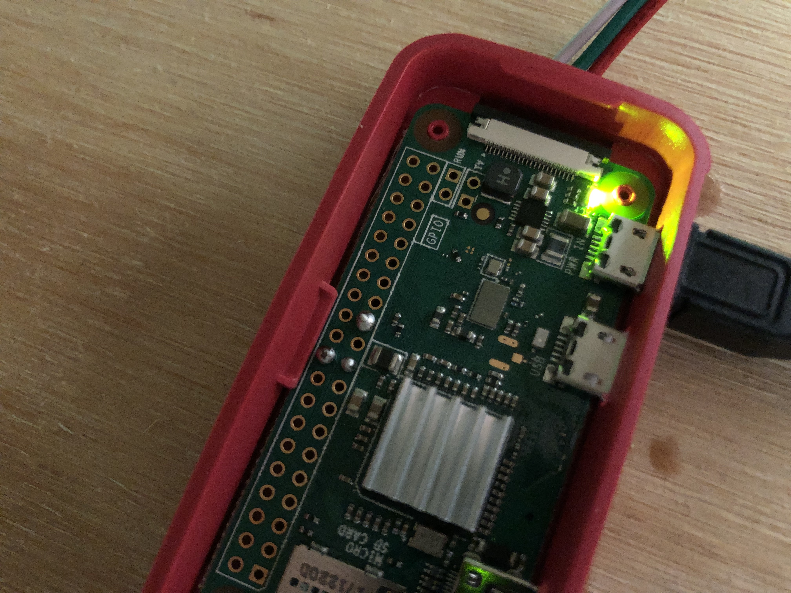
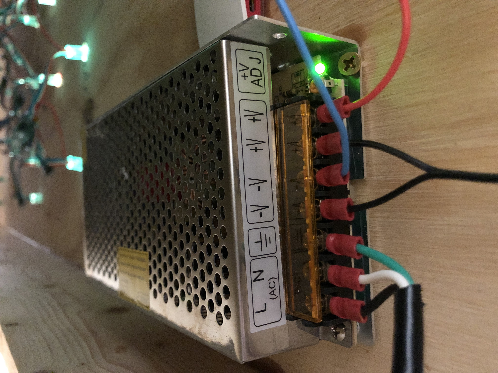

# VFR Light Map

This is a fork of JoshnMarzulli's excellent "[Categorical-Sectional](https://github.com/JohnMarzulli/categorical-sectional)".

The purpose of this version is to add a few features such as LED dimming for use in dark rooms, as well as add support for large installations (over 49 LEDs).  Also, re-writing/editing the instructions for clairity.  I have put very little work into the actual program or code, that's ALL John and others...I take no credit for his wonderful work!


## What You Need

### Skills Required

To complete this project you will need to:

- Edit two text files.
- Solder three wires.

### Additional Hardware

The instructions given here are for WS2801 LED based strands, such as those found on AdaFruit.

The electronics cost about \$90 USD if you are buying everything new, and want 50 lights.

To complete the project you will need to supply your own chart and backing board.

Soldering is required for three (3) wires, along with some electrical tape, crimp connectors, and strippers.

To finish the instalation you will need a monitor, and a keyboard to program the Pi.

You can make your map look as simple or fancy as you'd like, I like the look of putting a frame on the map and pouring apoxy over the whole thing, gives it a very professional look as well as enshrines your "functional art".

#### Other Raspberry Pis

A parts manifest lists a Raspberry Pi Zero due to its size and lower power consumption, but a spare 2 or 3 will work as long as it has WiFi. The wiring diagram does not change.

## Setup

### Parts List

The below list is a minimum to make the map functional, obviously you'll need tools such as a soldering iron and crimpers as well as a few misc. that any DIYer would likely have.

| Description                                  | Cost    | Link                                                                                                                                                                   |
| -------------------------------------------- | ------- | ---------------------------------------------------------------------------------------------------------------------------------------------------------------------- |
| Raspberry Pi Zero W | \$30 | <https://www.amazon.com/CanaKit-Raspberry-Wireless-Starter-Official/dp/B06XJQV162/ref=sr_1_7?s=electronics&ie=UTF8&qid=1528557992&sr=1-7&keywords=raspberry+pi+zero+w> |
| Individually addressable LEDs (WS2801 based) | \$26 | <https://www.amazon.com/gp/product/B0192X56MM/ref=oh_aui_search_asin_title?ie=UTF8&psc=1> |
| Power Supply for Pi and LEDs | \$14 | <https://www.amazon.com/gp/product/B01LZRIX96/ref=ox_sc_saved_image_2?smid=ARYZM74F47MOK&psc=1> |
| Power Cable | \$9 | <https://www.amazon.com/gp/product/B0109OJJS0/ref=ppx_yo_dt_b_asin_title_o01_s00?ie=UTF8&psc=1> |
| JST 3 Pin Adapters | \$8 | <https://www.amazon.com/gp/product/B075K4BP8N/ref=ppx_yo_dt_b_asin_title_o00_s00?ie=UTF8&psc=1>  |

### Bootstrapping The Raspberry Pi

#### OS Instalation

This section gets you started with instaling the software.  There are many details left out, as I'm assuming you generally know what you're doing in a CLI and with a Pi.

A full tutorial on how to install the Operating System is available at: <https://www.raspberrypi.org/documentation/installation/noobs.md>

1. Boot the Raspberry Pi with the empty SD card.
2. You will be given a choice of operating systems to install. You will also be asked for your WiFi network and password.
3. Choose the WiFi network that will be used when the project is completed.
4. Choose "Raspbian" as the operating system.
5. When it is finished, login with the username:pi password:raspberry
6. I reccomend putting an update script in the root crontab to run weekly in the middle of the night, (I run it at 3am on Friday mornings) an example would be:

```bash
apt-get clean; apt-get update; apt-get upgrade -y; apt-get autoremove; reboot
```

#### Get The Code

From the CLI, after logging in:

```bash
cd ~
git clone https://github.com/edwardthev/categorical-sectional.git
```

This will install this software onto the Raspberry Pi.

#### Python Package Install

From a terminal on the Raspberry Pi

```bash
cd ~/categorical-sectional
sudo python3 setup.py develop
```

#### Raspberry Pi Settings

Run 'raspi-config' and enable the "SPI Bus" and "SSH" under Interfacing Options

```bash
sudo raspi-config
```

## Wiring

### Wiring the WS2801

If you are using multiple strands of lights, plug the MOSI and SCLK together, and use butt connectors and solder to connect the red (+5v) and blue (ground) wires together. MAKE SURE you're starting with the proper side of the light, there is an IN and OUT of each LED.  The "in" is the side that has the small arrow on the left side pointing up. (The side opposite the small black micro-board.)

Properly terminate the red and blue tap wires at the end of the strand, I reccomend a terminating butt connector.

Leave the red and blue wire at the start of the strand for the moment.

### The Power Supply

**Don't get hurt, if you're not comfortable with electricity, ask a friend!!**

Mount the power supply on the back of your board, prefereably in a place that gets a good airflow and isn't touching other cables.

### The Raspberry Pi

Use the group of three wires from a _*male*_ JST SM adapter.

Solder them to the board.

| Wire Color | Physical Pin                                | Pin Name      |
| ---------- | ------------------------------------------- | ------------- |
| Red        | 23                                          | SCLK          |
| White      | 20                                          | GRND          |
| Green      | 19                                          | MOSI          |

#### Wiring Detail From Top



## Final Assembly

- Connect the Male JST and LED connectors together.
- Mount the Pi to the back of your board, in close proximity to your "first" hole for airport, and near the power supply.
**Use of a power supply can be dangerous and lethal if done wrong, ask a friend if you're not comfortable**
- Connect the red (5v) and blue (ground) from the LEDs to the power supply using spade connectors. (I mounted my power supply next to the Pi on the back of the board)
- Cut the micro-usb power to legnth, and connect to the power supply using the spade connectors. (Dashed lines go to the negative, and side with writing goes positive - if you want to double check, you can break open the transformer on the plug that came with your Pi, as it's not needed)
- Cut the "extension cord" to legnth, and attach to the power supply using spade connectors.
- Drill the appropriate holes for the airports you want to view, and write the airport and LED number (see numbering below) next to the hole in sharpie, it will make your job easier in the future!



## Understanding The Configuration Files

All of the configuration files will be in the "data" sub directory.

Unless you are building the same exact map that I did (Puget Sound to Oshkosh), then you will want to modify at least one of these.

### data/config.json

This is the first file loaded. It tells the software what type of lights are being used, and which airport file to open.

```json
{
  "mode": "ws2801_bright",
  "pixel_count": 164,
  "spi_device": 0,
  "spi_port": 0,
  "airports_file": "data/usa.json",
  "night_lights": true
}
```

#### night_lights

Set this to true if you would like the weather stations to change colors based on the time of day.

If you are using WS2801 or PWM based lights, then this is a gradual process.

First the light will fade from the flight condition color to a bright yellow to indicate "Populated night".
As the station gets darker, the light fades to a darker yellow by the time the station is "pitch black" in night.

In the morning, the light will increase back to a bright yellow as the office sunrise time approaches.
As the station approaches full daylight, the light will fade from bright yellow to the color appropriate for the flight condition.

#### mode

This controls which type of LED system to use for controlling the lights.

| Value         | Description                                                                                      |
| ------------- | ------------------------------------------------------------------------------------------------ |
| ws2801        | Use WS2801 based light strands.                                                                  |

#### pixel_count

If you are using ws2801 based LEDs then you may need to change "pixel_count". Each strand will come with a numbe rof LEDs. You you are using a single strand, then set this number to that count. If you have combined strands, then set the total number of lights.

#### spi_device and spi_port

You will probably not need to change this. If you do need to change this, then you probably know what to do.


#### airports_file

This is the file that contains the airport names and the wiring configuration for them.

### Airports File

#### Annotated Example File


```json
{
  "ws2801": [
    { "KRNT": { "neopixel": 0 } },
    { "KSEA": { "neopixel": 2 } },
    { "KPLU": { "neopixel": 4 } },
    { "KOLM": { "neopixel": 6 } },
    { "KTIW": { "neopixel": 8 } },
    { "KPWT": { "neopixel": 10 } },
    { "KSHN": { "neopixel": 12 } }
  ]
}
```

##### ws2801

This section contains the information required to control a strand of WS2801 lights.

Once again, this starts with an airport or weather station identifier.

Next to contains a "neopixel" identifier. This is the order of the light on the strand.

_NOTE:_ The first light is "0", the second light is "1".

Due to the way your lights may need to be arranged to fit on the map, some lights may need to be skipped, so keep track of your lights.

##### Illustration of Numbering

Using the first few lines of the ws2801 section from above, this shows how the numbering works.

This project uses "zero based indexing".

In this scenario the second and fourth light are not used. They will remain off the entire time.

The first light is assigned to Renton airport.
The third light will show SeaTac aiport.

```code
[Pi] ------[LED]------[LED]------[LED]------[LED]

           0/KRNT    Skipped     2/KSEA    Skipped
```

## Running It At Boot

To run it at boot, perform the following steps:

1. Log into the device as the user "pi" with password "raspberry".
2. Type "crontab -e"
3. Select "Nano" (Option 1)
4. Enter the following text at the _bottom_ of the file:

```code
@reboot sleep 90 && python3 /home/pi/categorical-sectional/controller.py &
```

5. Save the file and exit.
6. sudo reboot now

Capitalization counts. The map lights should come on with each boot now.

## Colors

This project uses "standard" airport coloring for flight rules category, along with some unique colors.

| Flight Rule | WS2801         | PWM            | LED            |
| ----------- | -------------- | -------------- | -------------- |
| VFR         | Solid green    | Solid green    | Solid green    |
| MVFR        | Solid blue     | Solid blue     | Solid blue     |
| IFR         | Solid red      | Solid red      | Solid red      |
| LIFR        | Solid magenta  | Solid magenta  | Blinking red   |
| Smoke       | Solid gray     | Solid gray     | Solid gray     |
| Night       | Solid yellow   | Solid yellow   | Solid yellow   |
| Error       | Blinking white | Blinking white | Blinking white |

## Apendix

<https://learn.adafruit.com/12mm-led-pixels/wiring>
<https://tutorials-raspberrypi.com/how-to-control-a-raspberry-pi-ws2801-rgb-led-strip/>
<https://www.raspberrypi.org/documentation/linux/usage/cron.md>

## Version History

| Version | Change                                                                                                                                                                            |
| ------- | --------------------------------------------------------------------------------------------------------------------------------------------------------------------------------- |
|   1.4   | Changes to map initialization to help with bad airport identifiers. Improve handling of mismatch between four and three letter long identifiers when determining day/night cycle. |
|   1.3   | Performance improvements.                                                                                                                                                         |
|   1.2   | Migrated to Python 3.x                                                                                                                                                            |
|   1.1   | Day / Night cycle.                                                                                                                                                                |
|   1.0   | First release with adressable lights.                                                                                                                                             |

## Credits

Airport Location data from <http://ourairports.com/data/>
Airport sunrise/sunset data from <https://sunrise-sunset.org/api>

## License

This project is covered by the GPL v3 liscense.

Please see [LISCENSE.md](LISCENSE.md)
